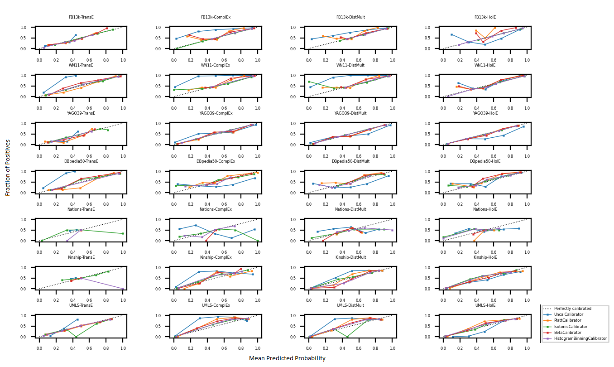
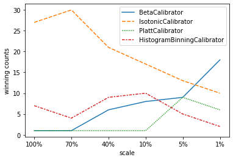

# REvisiting Probability Calibration in Knowledge Graph Embedding

## Introduction

motivation

knowledge graph

probabilistic knowledeg graph

KGE cal:  KV, benefit of calibrated probs

### Related Workds

KGE

Calibration

KGE Cal

There are much more calibration techniques proposed these years. We testted more calibration techniques for these KGE modles on more datasets. During the experiments, we also have other interesting findings. We found that not all probabilities can be obtained via expit transform, What's more, we also found and confirmed some hints for selection of calibration techniques. .

### Main Findings

1. We reprecated and extended the previous experiments. We confirmed their conclusion that KG Embedding models are uncalibrated, and techniques like Platt Scaling, Isotonic Regression, and others can calibrated the KGE models, producing good probabilities.
2. We also analysed the reason of uncalibrated probabilities, and pointed out the potential flaws of previous works: it is inappropriate to recognise converting expit transformed values (simply pass the embedding scores through a sigmoid layer) as probabilities. Whether we can obtain probabilities via expit transform depends on the scoring function and the loss fuction. This also indicates that we'd better convert the embedding scores to probabilities directly via platt scaling or isontonic regression, instead of expit transform.
3. We also found a more useful rule of thumb about how to choose calibration techqniue: when we have a large set of held-out data (over 10 thousand triples), we should definitely choose binning-based calibration techniques, such as Isonotic Regression, otherwise scaling-based techqniues, such as Platt Scaling, would be more suitable. 

## Preliminaries

define KG

define KGE

define cal

define KGE cal

## Experiment Setup

In our experiment, we trained 4 typical KE embedding models, TransE, ComplEx, DistMult, and HoLE on 7 datasets: FB13k, WN11, YAGO39, DBpedia50, Nations, Kinship, UMLS. Each dataset is splited into 3 subset for train, valid, and test. Note that the valid and test set of FB13, WN11 and YAGO39 have ground truth negative samples, while the other 4 don't have. Thus, we generate synthetic negative samples via the corrption and local closed world assumtion. Statistics of the datasets are summarisd in table 1.

|            |   train |   valid |   test |   ents |   rels |
|:-----------|--------:|--------:|-------:|-------:|-------:|
| FB13k      |  316232 |   11816 |  47464 |  75043 |     13 |
| WN11       |  110361 |    4877 |  19706 |  38194 |     11 |
| YAGO39     |  354994 |   18471 |  18507 |  37612 |     37 |
| DBpedia50  |   32388 |     246 |   4196 |  24624 |    351 |
| UMLS       |    5216 |    1304 |   1322 |    135 |     46 |
| Kinship    |    8544 |    2136 |   2148 |    104 |     25 |
| Nations    |    1592 |     398 |    402 |     14 |     55 |

We used the implementation of Knowledge Graph Embedding Models from AmpliGraph, and used implementation calibration techniques from NetCal.

## Results

We run 4 calibration techniques: Platt Scaling, Isotonic Regression, and two recently developed ones, Beta Calibration, and Histogram Binning, for every KG Embedding models. During experiment, we trained the KGE models only use the train set, and train the calibration model using valid set. In diagram 1, the calibration curves illustrate that the KG Embedding models are more or less uncalibrated, and almost all calibration techqniues produced better-calibrated probabilities than those obtained via expit transform, which are recognised as uncalibrated probabilities.

We use these probabilities to perform triple calissfication task. Diagram 3 shows that the calibrated probabilities can serve as a good indicator to classify the positve triples from the negative ones. It achieve STOA results as the literature standard of per-relation threshold. 

| FB13k     | Uncal | Platt | Isot  | beta  | histbin |
|-----------|-------|-------|-------|-------|---------|
| TransE    | 0.500 | 0.672 | 0.672 | 0.673 | 0.668   |
| ComplEx   | 0.554 | 0.648 | 0.693 | 0.692 | 0.594   |
| DistMult  | 0.575 | 0.613 | 0.642 | 0.604 | 0.603   |
| HolE      | 0.557 | 0.488 | 0.639 | 0.602 | 0.733   |

| WN11      | Uncal | Platt | Isot  | beta  | histbin |
|-----------|-------|-------|-------|-------|---------|
| TransE    | 0.507 | 0.883 | 0.881 | 0.879 | 0.881   |
| ComplEx   | 0.559 | 0.590 | 0.623 | 0.623 | 0.601   |
| DistMult  | 0.566 | 0.602 | 0.632 | 0.631 | 0.617   |
| HolE      | 0.621 | 0.692 | 0.698 | 0.695 | 0.697   |

| YAGO39    | Uncal | Platt | Isot  | beta  | histbin |
|-----------|-------|-------|-------|-------|---------|
| TransE    | 0.506 | 0.695 | 0.720 | 0.698 | 0.690   |
| ComplEx   | 0.896 | 0.900 | 0.905 | 0.896 | 0.901   |
| DistMult  | 0.892 | 0.889 | 0.893 | 0.890 | 0.893   |
| HolE      | 0.834 | 0.852 | 0.852 | 0.850 | 0.852   |

| DBpedia50 | Uncal | Platt | Isot  | beta  | histbin |
|-----------|-------|-------|-------|-------|---------|
| TransE    | 0.500 | 0.858 | 0.876 | 0.870 | 0.875   |
| ComplEx   | 0.615 | 0.668 | 0.667 | 0.667 | 0.629   |
| DistMult  | 0.649 | 0.696 | 0.707 | 0.698 | 0.704   |
| HolE      | 0.645 | 0.743 | 0.753 | 0.731 | 0.753   |

| Nations   | Uncal | Platt | Isot  | beta  | histbin |
|-----------|-------|-------|-------|-------|---------|
| TransE    | 0.50  | 0.525 | 0.498 | 0.520 | 0.512   |
| ComplEx   | 0.43  | 0.418 | 0.567 | 0.463 | 0.587   |
| DistMult  | 0.49  | 0.522 | 0.520 | 0.532 | 0.570   |
| HolE      | 0.52  | 0.535 | 0.537 | 0.500 | 0.520   |

| Kinship   | Uncal | Platt | Isot  | beta  | histbin |
|-----------|-------|-------|-------|-------|---------|
| TransE    | 0.500 | 0.530 | 0.543 | 0.534 | 0.521   |
| ComplEx   | 0.712 | 0.741 | 0.804 | 0.792 | 0.796   |
| DistMult  | 0.868 | 0.891 | 0.894 | 0.892 | 0.895   |
| HolE      | 0.795 | 0.793 | 0.791 | 0.799 | 0.788   |

| UMLS      | Uncal | Platt | Isot  | beta  | histbin |
|-----------|-------|-------|-------|-------|---------|
| TransE    | 0.500 | 0.771 | 0.770 | 0.769 | 0.760   |
| ComplEx   | 0.838 | 0.893 | 0.899 | 0.898 | 0.902   |
| DistMult  | 0.850 | 0.880 | 0.884 | 0.884 | 0.884   |
| HolE      | 0.875 | 0.868 | 0.869 | 0.878 | 0.876   |

However, the devil is in the detials. We noted that the accuracy of uncalibrated probabilities of TransE in all dataset got nearly 50%, which means no better than random guess. By inspecting the calibration curves of TransE uncalibrated probabilities, we could see that none of these values are greater than 0.5. Therefore, when using 0.5 as a threshold, we classified all triples as negatives, leading to the results similar to random guesses! We plot the histograms of "uncalibrated probabilities" of TransE. Why this happened? Because these uncalibrated probabilities were obtained by applying a sigmoid function on the embedding scores, and we noticed that the implementation of TransE in AmpliGraph adopted such a loss function:
$$
f_{TransE}=-||(\mathbf{e}_s + \mathbf{r}_p) - \mathbf{e}_o||_n
$$
Hence $f_{TransE}( s, p, o ) \in [-\infty ,0] $, and thus $\sigma\big(f_{TransE}( s, p, o )\big) \in [0, 0.5]$. Though "What is probability" is more or less a philosophical question, I believe $\sigma\big(f_{TransE}( s, p, o )\big)$ can hardly be recognised as probabilities, whether calibrated or uncalibrated. 

We observed that binning-based calibration performs better in general. We also noticed that binning-based methods dominated only in FB13k, WN11 and YAGO39. We hypothesised that perhaps that's because there are more data in these 3 datasets. Previous work also suggested that binnig-based methods tend to overfit, expecially in smaller datasets. Thus, we take these 3 datasets, and gradaully shrink the size of valid set by randomly samping k%, and compare the number of winning between binning-based and scaling-based methods. 

Diagram 2 shows that as the size of the dataset shrink, the winning count of binning-based methods decreases while caling-based method increases, i.e., scaling-based calibration start to gain better calibration peroformance than binning-based techqniue in some cases.

## Discussion
